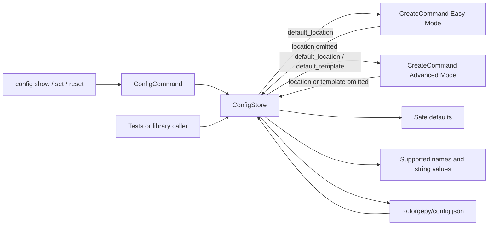
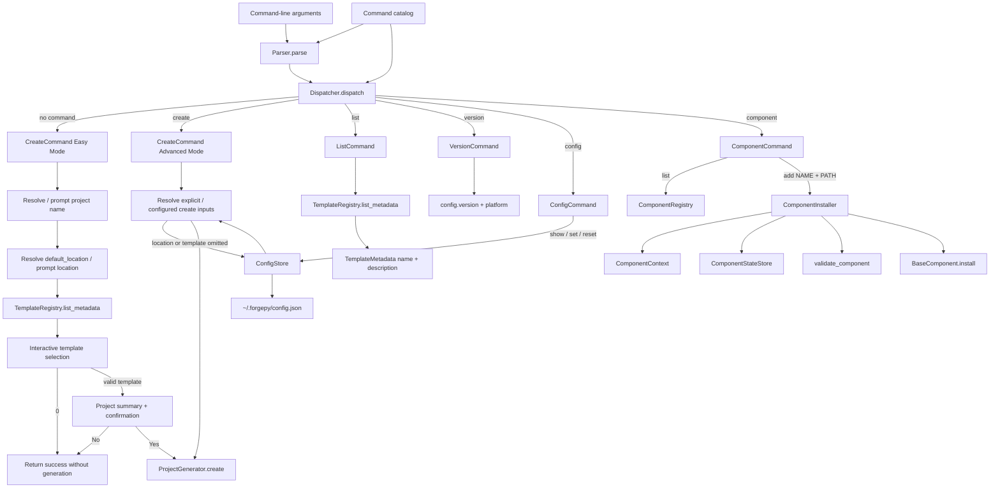
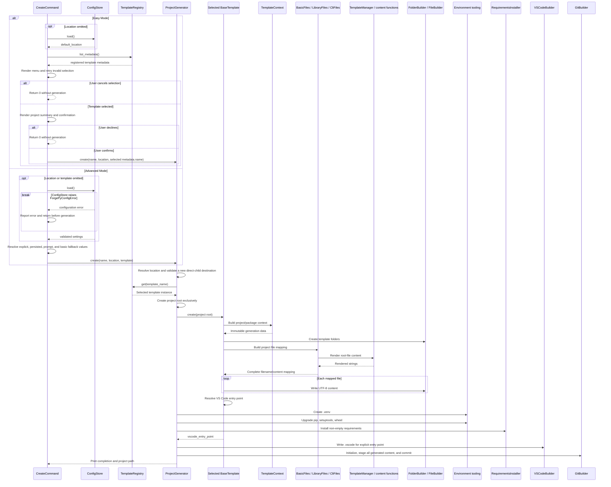

# ForgePy Architecture

## Overview

ForgePy is a layered command-line application. The CLI parses user input and selects a command. When no command is supplied, the dispatcher selects `create` and `CreateCommand` enters Easy Mode: it resolves the project name and location, presents template metadata from `TemplateRegistry`, asks for confirmation, and only then delegates to `ProjectGenerator`. Explicit `create` usage remains Advanced Mode and preserves configuration-driven template fallback without opening the template wizard. `ProjectGenerator` coordinates template rendering and setup services. The template registry keeps presentation metadata alongside executable templates so both listing and interactive selection can inspect the catalog without invoking generation. Built-in templates separate per-generation context, template-owned file mappings, and explicit VS Code entry-point rules; their common execution layer delegates folder and file writes to the existing builders. An independent component package provides metadata, a declarative installation manifest, a validated existing-project context, minimal installation hooks, the `pytest`, `ruff`, and `github-actions` built-ins, and an in-memory registry. The component CLI lists that catalog, reads project-local installed state, and delegates explicit installation to `ComponentInstaller` without entering the generation flow.

## Directory structure

```text
ForgePy/
|-- .github/workflows/       Repository CI and PyPI publishing workflows
|-- builders/                 Reusable file-system and Python-tool builders
|-- cli/                      Argument parsing, dispatch, and command objects
|   `-- commands/             Implementations and the shared command catalog
|-- components/               Independent component contracts and registry
|   |-- base_component.py     Abstract identity/metadata/manifest/install contract
|   |-- component_context.py  Validated existing-project context
|   |-- component_installer.py Fixed single-component installation flow
|   |-- component_manifest.py Immutable declarative installation properties
|   |-- component_metadata.py Immutable descriptive component metadata
|   |-- component_registry.py In-memory built-in and explicit registration
|   |-- component_state.py    Project-local installed-name persistence
|   |-- component_validation.py Stateless direct relationship validation
|   |-- github_actions_component.py Built-in GitHub Actions CI workflow
|   |-- pytest_component.py    Built-in isolated pytest configuration
|   `-- ruff_component.py      Built-in isolated Ruff configuration
|-- config/                   Application and user configuration
|   |-- default_structure.py  Generated project layout defaults
|   |-- user_config.py        Persistent user configuration store
|   `-- version.py            Canonical ForgePy version metadata
|-- core/                     Project workflow and environment/tool integrations
|-- models/                   Project configuration data model
|-- templates/                Generated file content and template facade
|   |-- basic/                Basic template and its generated-file mapping
|   |-- cli/                  Minimal command-line application template
|   |-- library/              Minimal Python library template implementation
|   |-- template_engine/      Contracts for execution, context, metadata, registry, naming, and compatibility
|   `-- vscode/               VS Code JSON content generators
|-- utils/                    Reserved utility package; logger is currently empty
|-- main.py                   Application entry point
|-- pyproject.toml            Setuptools build and distribution metadata
|-- README.md                 Public installation and usage guide
|-- AGENTS.md                 Working rules for human and AI agents
|-- ARCHITECTURE.md           Current structure and dependency flows
|-- CHANGELOG.md              Release-facing Unreleased and tagged history
|-- CONTRIBUTING.md           Contribution and review workflow
|-- ENGINEERING_PRINCIPLES.md Engineering policy and completion criteria
|-- PROJECT_CONTEXT.md        Current development and handoff context
|-- ROADMAP.md                Implemented, active, planned, and idea states
|-- tests/                    Standard-library automated tests
`-- requirements.txt          Runtime dependency file; currently empty
```

## Module responsibilities

| Area | Responsibility |
| --- | --- |
| `.github/workflows/ci.yml` | Runs ForgePy's repository test matrix and Python 3.12 distribution validation; it is separate from generated component output. |
| `.github/workflows/publish.yml` | Builds fresh distributions and publishes only its uploaded artifact through PyPI Trusted Publishing. |
| `main.py` | Connects `Parser` to `Dispatcher`. |
| `cli/parser.py` | Defines CLI syntax, defaults, and subcommands. |
| `cli/command.py` | Defines command metadata, parser configuration, and execution contracts. |
| `cli/commands/__init__.py` | Registers the built-in commands in one explicit catalog. |
| `cli/commands/create_command.py` | Separates no-command Easy Mode from explicit Advanced Mode, resolves project inputs, renders the interactive template wizard and confirmation flow, and invokes project generation only after approval. |
| `cli/commands/config_command.py` | Adapts configuration actions, output, and ForgePy configuration errors for the CLI.|
| `cli/commands/component_command.py` | Lists registered components, presents project-local installed state, delegates add operations to `ComponentInstaller`, and adapts operational errors for the CLI. |
| `cli/dispatcher.py` | Builds command lookup from the shared catalog; defaults to `create`. |
| `cli/commands/` | Validates command-level input and invokes application services. |
| `models/project_config.py` | Validates a generated-content-safe, Windows-compatible project name for portability across supported platforms, stores the selected location, and derives the root path. |
| `core/project_generator.py` | Orchestrates the complete create workflow. |
| `core/environment_builder.py` | Creates `.venv` with the running Python interpreter. |
| `core/requirements_installer.py` | Installs generated requirements through the new environment's Python executable using `python -m pip`. |
| `core/git_builder.py` | Requires Git, initializes the repository, stages files, and creates the required initial commit. |
| `core/vscode_builder.py` | Renders and writes `.vscode` files for an explicit template entry-point requirement. |
| `builders/` | Creates folders/files and upgrades Python packaging tools. |
| `components/base_component.py` | Defines abstract component `name`, `metadata`, `manifest`, and minimal `install(context)` behavior. |
| `components/component_context.py` | Validates the existing project directory supplied explicitly to installation. |
| `components/component_installer.py` | Coordinates lookup, context, installed state, direct validation, one installation hook, and post-success state recording. |
| `components/component_manifest.py` | Defines immutable owned-file, dependency, and conflict declarations without resolution behavior. |
| `components/component_metadata.py` | Defines immutable descriptive metadata for component definitions. |
| `components/component_registry.py` | Registers the built-in catalog deterministically, validates explicit in-memory registrations, and provides lookup and immutable ordered listing. |
| `components/component_state.py` | Safely persists deterministic installed component names under an explicitly supplied existing project. |
| `components/component_validation.py` | Validates direct manifest dependencies and conflicts against caller-supplied installed names without side effects. |
| `components/github_actions_component.py` | Defines the built-in component that exclusively creates its declared `.github/workflows/ci.yml` in an existing project. |
| `components/pytest_component.py` | Defines the built-in component that exclusively creates its declared `pytest.ini` in an existing project. |
| `components/ruff_component.py` | Defines the built-in component that exclusively creates its declared `ruff.toml` in an existing project. |
| `templates/basic/basic_template.py` | Declares the basic metadata, folders, file mapping, and `app.py` VS Code default through shared execution hooks. |
| `templates/basic/basic_files.py` | Owns the complete basic-template mapping and renders its content through `TemplateManager`. |
| `templates/cli/cli_template.py` | Declares the normalized CLI context, folders, file mapping, and context-derived VS Code entry point. |
| `templates/cli/cli_files.py` | Owns the complete CLI mapping and renders root content and argparse application modules. |
| `templates/library/library_template.py` | Declares the normalized library context, folders, file mapping, and no-entry-point VS Code default. |
| `templates/library/library_files.py` | Owns the complete library mapping and renders root content plus empty package initializer files. |
| `templates/template_engine/base_template.py` | Defines the stable template name, metadata, harmless preflight, creation, and VS Code entry-point contracts. |
| `templates/template_engine/file_template.py` | Implements the common context, folder, ordered-file-write, and VS Code entry-point-resolution lifecycle for built-ins. |
| `templates/template_engine/package_name.py` | Normalizes project names into ASCII Python package identifiers for package-oriented templates. |
| `templates/template_engine/template_context.py` | Carries the project path/name and optional normalized package name for one generation. |
| `templates/template_engine/template_metadata.py` | Defines immutable registered-template metadata, including internal name/description/version/author/tags plus optional user-facing `display_name` and `use_cases`. |
| `templates/template_engine/template_registry.py` | Registers templates by metadata name and supplies template and metadata lookups. |
| `templates/template_engine/template_files.py` | Preserves the original `TemplateFiles.basic()` API as a facade over `BasicFiles`. |
| `templates/template_manager.py` | Provides one facade over generated root-file content. |
| `config/default_structure.py` | Supplies the basic generated-project directory list. |
| `config/user_config.py` | Loads, validates, updates, resets, and atomically saves user-level JSON configuration. |
| `config/version.py` | Supplies canonical application metadata. |
| `tests/test_component_registry.py` | Verifies component metadata, built-in and explicit registration, lookup, listing order, and rejection paths without installation side effects. |
| `tests/test_component_installer.py` | Verifies fixed installation sequencing, pre-install rejection, post-success recording, partial-success behavior, and boundary isolation. |
| `tests/test_component_state.py` | Verifies isolated project-local state loading, validation, deterministic atomic persistence, and registry independence. |
| `tests/test_component_validation.py` | Verifies direct dependency/conflict checks, aggregated failures, registry isolation, and validation without writes or installation. |
| `tests/test_github_actions_component.py` | Verifies GitHub Actions metadata, manifest, registration order, nested workflow creation, installer integration, isolation, and existing-target behavior. |
| `tests/test_repository_ci.py` | Verifies repository CI triggers, Windows/Linux/CPython matrix, validation commands, artifact inspection, wheel installation, and installed CLI probes without parsing a full YAML snapshot. |
| `tests/test_pytest_component.py` | Verifies pytest metadata, manifest, deterministic registration, isolated installation, and existing-target behavior. |
| `tests/test_ruff_component.py` | Verifies Ruff metadata, manifest, deterministic registration, isolated installation, installer integration, and existing-target behavior. |
| `tests/test_config_command.py` | Verifies configuration parsing, dispatch, output, persistence, reset, and error handling with an isolated home. |
| `tests/test_create_command.py` | Verifies Easy/Advanced Mode separation, template selection, invalid-input retry, cancellation, confirmation, create-input precedence, configuration errors, and generator delegation without generating a real project. |
| `tests/test_cli_template.py` | Verifies CLI metadata, registration, exact output, normalization, module execution, help, version, and editor-entry execution. |
| `tests/test_library_template.py` | Verifies library metadata, registration, exact output, name normalization, generator selection, and basic compatibility in temporary directories. |
| `tests/test_template_architecture.py` | Verifies context/entry-point separation, the basic mapping facade, exact pre-refactor template-output snapshots, and context-derived CLI entry points. |
| `tests/test_template_registry.py` | Verifies metadata, registration, lookup compatibility, and list output without generation or file-system effects. |
| `tests/test_user_config.py` | Verifies configuration behavior in temporary home directories. |
| `tests/test_vscode_builder.py` | Verifies template-aware editor output for all built-in templates in temporary directories. |

## Version Source

`config/version.py` is the canonical source for the ForgePy application version. `VersionCommand` imports `APP_NAME` and `VERSION` from that module and adds the conventional `v` prefix only when displaying the release. Module docstrings do not duplicate release numbers.

Versions rendered into generated projects, template metadata versions, and version fields required by VS Code JSON schemas are independent of the ForgePy release version. The `basic` metadata records `0.6.0`, while `library` and `cli` start at `0.1.0` as independent template revisions; this does not make `config/version.py` a template-version source.

The root `pyproject.toml` names the Python distribution `forgepy-cli`, uses
setuptools to discover only the runtime package families, and exposes
`forgepy = main:main` as the installed console command. The application and CLI
identity remain ForgePy and `forgepy`; the distribution name affects package
installation and metadata only.
Its distribution version is read dynamically from `config.version.VERSION`,
its Markdown long description comes from `README.md`, and its verified project
URLs point to `rzou89/ForgePy` and its issue tracker. It declares no
third-party Python runtime dependencies or non-Python package data. Release
metadata classifies the prepared `1.0.0` release as
`Development Status :: 5 - Production/Stable`; repository licensing
uses the SPDX expression `MIT` and includes the root `LICENSE` file through
PEP 639 metadata. No legacy license classifier is used.

The current application version is `1.1.0`, and the `v1.1.0` Git tag and GitHub
Release exist. The version remains dynamically sourced from
`config.version.VERSION`. `forgepy-cli` 1.1.0 is published on PyPI.

`.github/workflows/publish.yml` builds a fresh wheel and sdist in an unprivileged
job, transfers only those files as a workflow artifact, and publishes them in a
separate `pypi` environment through GitHub OIDC and the official PyPA action.
The publisher identity is `rzou89/ForgePy`, workflow `publish.yml`, environment
`pypi`. It stores no PyPI username, password, API token, or repository secret.
Future GitHub Releases trigger publication through the workflow; `workflow_dispatch`
remains available as a deliberate manual publication path for releases that need
to be published outside the normal release-event flow.

## Release validation baseline

The v1.0 release-validation baseline established the full unit suite, `compileall`, source-tree
CLI smoke checks, and fresh wheel and sdist builds as the expected release gate. Artifact inspection must
confirm the canonical version, README metadata, MIT metadata and license file,
the console entry point, required runtime packages, the sdist changelog and
`pyproject.toml`, and exclusion of `tests` and `utils`. The built wheel must then
be installed into a clean isolated environment and its installed CLI exercised
outside the source checkout.

The final automated-local gate is a temporary installed-wheel project creation
that verifies template output, `.venv`, applicable VS Code files, Git repository
initialization and initial commit, successful exit, and confinement outside the
ForgePy checkout. Git availability is checked first and test identity is
isolated without changing global Git configuration. Temporary artifacts are
removed after validation.

GitHub-hosted `windows-latest` matrix success is evidence for the hosted runner,
not literal Windows 10 and Windows 11 client validation. Native-client results
must be recorded separately before either client edition is claimed as tested.

## User Configuration

`ConfigStore` persists user-level settings at `~/.forgepy/config.json`. Its constructor accepts an alternate home directory so tests and library callers can isolate all file-system effects. `ConfigCommand` exposes the store without duplicating its validation or persistence rules.



The supported defaults are `default_template = "basic"`, `default_location = ""`, `author = ""`, and `license = "MIT"`. Loading a missing file returns a new defaults dictionary without creating the directory. Saving creates the directory andatomically replaces the JSON file. Updates preserve other settings; reset is the explicit operation that replaces persisted content with defaults.

`config show` delegates to `ConfigStore.load()`, `config set KEY VALUE` delegates to `ConfigStore.update()`, and `config reset` delegates to `ConfigStore.reset()`. The command formats successful output and converts errors derived from `ForgePyConfigError` into concise CLI messages. A failed show or set does not replace malformed user data; reset is the explicit recovery operation that persists defaults.

`CreateCommand` reads configuration only when the active mode needs it. In Easy Mode, an omitted location may use `default_location`, but template choice is presented through `TemplateRegistry` metadata rather than silently applying `default_template`. In Advanced Mode, omitted location and template values use `default_location` and `default_template`; an empty configured location preserves the location prompt, while an empty configured template falls back to `"basic"`. Explicit Advanced Mode arguments have priority. If a required configuration read fails, the command reports the ForgePy configuration error and stops before generation. Fully explicit Advanced Mode creation does not read configuration.

`author` and `license` remain persisted but unused. `ProjectGenerator`, builders, and templates do not import the store or receive its mapping, so the generation lifecycle and generated files are unchanged.

## Dependency flow

```mermaid
flowchart TD
    Main[main.py] --> Parser[Parser]
    Main --> Dispatcher[Dispatcher]
    Parser --> Namespace[argparse Namespace]
    Namespace --> Dispatcher

    Parser --> Catalog[Command catalog]
    Dispatcher --> Catalog
    Catalog --> Create[CreateCommand]
    Catalog --> List[ListCommand]
    Catalog --> Version[VersionCommand]
    Catalog --> Config[ConfigCommand]

    Dispatcher --> Create
    Dispatcher --> List
    Dispatcher --> Version
    Dispatcher --> Config
    Dispatcher --> Component[ComponentCommand]

    Create --> UserConfig
    Create -->|Easy Mode template catalog| Registry[TemplateRegistry]
    Create --> Generator[ProjectGenerator]
    List --> Registry
    Registry --> TemplateMetadata[TemplateMetadata]
    Version --> VersionConfig[config.version]
    Config --> UserConfig[ConfigStore]
    Component --> ComponentRegistry
    Component --> ComponentInstaller
    ComponentInstaller --> ComponentRegistry
    ComponentInstaller --> ComponentContext
    ComponentInstaller --> ComponentStateStore
    ComponentInstaller --> ComponentValidation
    ComponentInstaller -->|install context| BaseComponent
    UserConfig --> ConfigFile[~/.forgepy/config.json]

    subgraph ComponentFoundation[Independent component foundation]
        ComponentRegistry[ComponentRegistry] --> BaseComponent[BaseComponent]
        ComponentRegistry --> PytestComponent[PytestComponent]
        PytestComponent --> BaseComponent
        ComponentRegistry --> ComponentMetadata[ComponentMetadata]
        ComponentRegistry --> ComponentManifest[ComponentManifest]
        BaseComponent --> ComponentMetadata
        BaseComponent --> ComponentManifest
        BaseComponent --> ComponentContext[ComponentContext]
    end

    Generator --> ProjectConfig[ProjectConfig]
    Generator --> Registry
    Registry --> Basic[BasicTemplate]
    Registry --> Library[LibraryTemplate]
    Registry --> Cli[CliTemplate]
    Basic --> TemplateMetadata
    Library --> TemplateMetadata
    Cli --> TemplateMetadata
    Basic --> FileTemplate[FileTemplate]
    Library --> FileTemplate
    Cli --> FileTemplate
    FileTemplate --> Context[TemplateContext]
    FileTemplate --> FolderBuilder[FolderBuilder]
    FileTemplate --> FileBuilder[FileBuilder]
    Basic --> BasicFiles[BasicFiles.build]
    Library --> LibraryFiles[LibraryFiles.build]
    Library --> PackageName[normalize_package_name]
    Cli --> CliFiles[CliFiles.build]
    Cli --> PackageName
    BasicFiles --> TemplateManager[TemplateManager]
    LibraryFiles --> TemplateManager
    CliFiles --> TemplateManager
    TemplateManager --> Content[Content template functions]
    Basic -->|app.py default| VSCodeRequirement[VS Code entry-point compatibility property]
    Library -->|None default| VSCodeRequirement
    Cli -->|context-derived package / cli.py| VSCodeRequirement

    Generator --> Environment[EnvironmentBuilder]
    Generator --> PythonTools[PythonToolsBuilder]
    Generator --> Requirements[RequirementsInstaller]
    Generator -->|project root + selected template requirement| VSCode[VSCodeBuilder]
    VSCode --> VSCodeTemplates[templates.vscode]
    Generator --> Git[GitBuilder]
```



CLI and orchestration layers depend on lower-level services. Template content modules do not depend on the CLI or generator. Builders receive paths and content rather than parsing arguments or selecting templates. `ComponentCommand` is the only application connection to the component foundation; components remain disconnected from configuration, templates, builders, `ProjectGenerator`, and generated-project creation.

## Class relationships

- `Command` defines the shared name, help metadata, parser-configuration hook, and execution contract implemented by `CreateCommand`, `ListCommand`, `VersionCommand`, `ConfigCommand`, and `ComponentCommand`.
- `cli.commands.create_commands()` is the single built-in command catalog used by both `Parser` and `Dispatcher`.
- `Dispatcher` derives its CLI-name mapping from that catalog.
- `CreateCommand` distinguishes Easy Mode from Advanced Mode using the parsed command value. Easy Mode resolves project name/location, reads registered template metadata for presentation, retries invalid menu input, supports cancellation, and requires confirmation before invoking `ProjectGenerator`. Advanced Mode preserves explicit/configured/basic template resolution and does not open the template wizard when `--template` is supplied. `CreateCommand` translates only marked pre-root validation, template-lookup, filesystem, and subprocess failures at the CLI boundary; unexpected downstream `KeyError` and `ValueError` failures propagate. Deliberate Easy Mode cancellation returns `0`, handled operational/user failures return `1`, `Dispatcher` propagates command status, and `main` converts it to the process exit code; argparse retains status `2` for syntax and usage errors. `ListCommand` reads descriptive metadata from `TemplateRegistry`, `VersionCommand` reads canonical application-version metadata, `ConfigCommand` delegates user-setting operations to `ConfigStore`, and `ComponentCommand` reads installed state or delegates add operations to `ComponentInstaller` while adapting operational errors for the CLI.
- `ProjectConfig` is a slotted dataclass used by `ProjectGenerator` to derive the target root. Its project name must be a non-empty, non-whitespace, single destination segment that is safe for current generated Python/TOML strings and the supported Windows filesystem contract. Control characters, Windows-invalid filename characters, leading or trailing ASCII spaces, trailing dots, and Windows reserved device stems (including extension forms and the superscript-digit `COM¹`-`COM³`/`LPT¹`-`LPT³` variants) are rejected explicitly. The accepted original name is not rewritten; package-oriented templates continue to normalize only their separate Python package name.
- `ComponentMetadata` is a frozen, slotted dataclass containing `name`, `description`, component `version`, `author`, and immutable `tags`. Construction validates scalar types, rejects empty or whitespace-only names, and snapshots tag iterables as tuples.
- `ComponentManifest` is a frozen, slotted dataclass containing owned or managed project-relative `pathlib.Path` entries, dependency names, and conflict names. Construction snapshots collections as tuples; rejects invalid or empty entries, duplicates, absolute paths, and lexical parent traversal; and performs no filesystem resolution.
- `ComponentContext` contains only a `pathlib.Path` for an existing project directory and rejects missing paths, files, and non-`Path` values before installation.
- `BaseComponent` exposes abstract `name`, `metadata`, `manifest`, and `install(context)` members. The hook defines no orchestration, rollback, discovery, or dependency behavior.
- `ComponentInstaller.install(name, project_path)` owns only the fixed sequence connecting registry lookup, context validation, project-local state loading, already-installed rejection, direct relationship validation, one installation hook, and state recording after hook success.
- `ComponentRegistry` deterministically registers `PytestComponent`, `RuffComponent`, then `GitHubActionsComponent`, stores component instances directly, requires matching component and metadata names, rejects self-dependency, self-conflict,and duplicate registrations before mutation, preserves registration order, and returns an immutable tuple from `list_components()`.
- `ComponentStateStore` uses an existing project path validated through `ComponentContext`, exposes load/save/add/membership operations, and atomically persists only installed component names at `.forgepy/components.json`. It resolves the project root, state directory, state file, and write-time temporary file and rejects any path that escapes its required in-project location. Missing state is empty; malformed state raises a component-state error and is not overwritten implicitly.
- `validate_component(component, installed_components)` checks only the selected component's direct manifest relationships against an explicit iterable of installed names. `ComponentValidationError` reports ordered missing dependencies and active conflicts together without installing or resolving anything.
- `PytestComponent` declares only `pytest.ini`, has no dependencies or conflicts, and installs by exclusively creating deterministic pytest configuration under `ComponentContext.project_path`. An existing target raises `FileExistsError` without modification.
- `RuffComponent` declares only `ruff.toml`, has no dependencies or conflicts, and installs by exclusively creating deterministic Ruff configuration under `ComponentContext.project_path`. An existing target raises `FileExistsError` without modification; no Ruff package or executable is installed.
- `GitHubActionsComponent` declares only `.github/workflows/ci.yml`, has no ForgePy component dependencies or conflicts,creates required parent directories, and exclusively writes a minimal deterministic Python CI workflow. The workflow installs pytest and Ruff on its GitHub Actions runner; local component installation installs no packages and modifies no project dependency files.
- `TemplateMetadata` is a frozen, slotted dataclass containing `name`, `description`, template `version`, `author`, immutable `tags`, optional `display_name`, and immutable `use_cases`. Construction validates scalar types, rejects empty or whitespace-only names, rejects an empty supplied display name, and snapshots tag/use-case iterables as tuples. `friendly_name` returns `display_name` when present and otherwise falls back to the stable internal template name.
- `BaseTemplate` exposes the stable public `name`, `create()`, metadata, `vscode_entry_point`, and harmless `preflight()` contracts. `FileTemplate.preflight()` constructs the same per-generation context used by `create()` so template-specific validation occurs without writes.
- `FileTemplate` is an opt-in `BaseTemplate` implementation used by the three built-ins. It derives `name` from the class's immutable metadata, builds a `TemplateContext`, creates declared folders, writes the ordered template-owned mapping through `FileBuilder`, and assigns its resolved VS Code entry point only after all writes succeed. `_DEFAULT_VSCODE_ENTRY_POINT` supplies static behavior, while `_vscode_entry_point_for(context)` resolves context-derived paths.
- `TemplateContext` is a frozen, slotted value containing the project path and an optional normalized package name. `project_name` is derived from the path; package-oriented hooks use a checked accessor. Normalization policy remains in `normalize_package_name()` and the Library/CLI wrappers. Library and CLI context construction therefore rejects an unusable package identifier during preflight, before the project root exists; basic context construction applies no package-name restriction.
- The public `vscode_entry_point` contract remains unchanged: `BasicTemplate` exposes `app.py`, `LibraryTemplate` exposes `None`, and `CliTemplate` resolves `<normalized-package>/cli.py` from its completed generation context.
- `TemplateRegistry.register()` is the single extension path. It accepts only `BaseTemplate` instances with `TemplateMetadata`, rejects empty names, requires `metadata.name` to match `template.name`, and rejects duplicates before changing registry state. It stores the template and metadata together under the authoritative metadata name. `get()` still returns the executable `BaseTemplate`; `get_metadata()` and `list_metadata()` expose descriptive data separately.
- `list_templates()` and the public `templates` view retain their existing name-to-template dictionary shape for compatibility, but return defensive snapshots so callers cannot desynchronize registry state.
- `BaseBuilder` is the parent of `FileBuilder`, `FolderBuilder`, and `PythonToolsBuilder`; it currently defines no methods.
- Core builder-style services are coordinated directly by `ProjectGenerator` and do not inherit from `BaseBuilder`.

## Component registry foundation

ForgePy registers `PytestComponent`, `RuffComponent`, then `GitHubActionsComponent` by default. `ComponentRegistry` remains an installation- and resolution-agnostic in-memory catalog: `register(component)` validates its contract, component/metadata identity, and absence of self-references, then stores one `BaseComponent`; `get(name)` returns the registered instance or preserves the standard `KeyError`; and `list_components()` returns an immutable tuple in registration order. Registration does not install components, look up dependencies, evaluate relationships between components, or select installation order.

`ComponentMetadata`, `ComponentManifest`, `ComponentContext`, and `BaseComponent` are independent from `TemplateMetadata`, `TemplateContext`, `BaseTemplate`, and `TemplateRegistry`; neither registry imports or registers objects from the other system. `component list` presents registered metadata without invoking installation. `component installed --project PATH` presents every name stored for that project without registry filtering or filesystem inference. `component add NAME --project PATH` delegates the fixed installation and state-recording sequence to `ComponentInstaller`. The component system performs no discovery, dependency resolution, installation ordering, rollback, uninstall, package installation, template association, or generation integration.

Pre-install relationship validation is an explicit, separate call. The caller supplies the complete set of component names it considers installed; the validator does not discover, load, or persist that state. Validation checks direct declarations only, reports every missing dependency and active conflict for the selected component, performs no registry lookup or filesystem operation, and never invokes `install()`. It does not validate transitive relationships, version constraints, optional dependencies, or installation order.

## Project-local component state

`ComponentStateStore(project_path)` owns only `.forgepy/components.json` below the validated existing project. The persisted document has one field:

```json
{
    "installed": [
        "example",
        "pytest"
    ]
}
```

`load()` resolves and confines `.forgepy` and `components.json` before reading, then treats a genuinely missing in-project file as `frozenset()`. `save(names)` validates non-empty strings, removes duplicates, sorts names for deterministic JSON, creates `.forgepy` when required, revalidates its resolved location, places and verifies a temporary file in that same directory, flushes and `fsync()`s it, and atomically replaces the confined destination. Existing symlinks, junctions, or equivalent redirections that resolve the directory or file outside the project raise `ComponentStateIOError` without reading, writing, replacing, or removing the redirected target. `add(name)` loads before saving so malformed existing data remains untouched; `is_installed(name)` checks the loaded state. Format and I/O failures use ForgePy-specific component-state errors.

The store is not used by `ComponentRegistry`, validation, or concrete installation hooks. `ComponentInstaller` connects it to an installation sequence, while the read-only `component installed --project PATH` CLI action loads it directly for presentation. Registered names and installed names remain separate. There is no uninstall, rollback, discovery, project scanning, component version locking, dependency resolution, installation ordering, or transitive traversal.

## Component installation orchestration

`ComponentInstaller` connects the independent component contracts for library callers while leaving each dependency responsible for its existing behavior. A default installer creates `ComponentRegistry`; tests and callers may inject a registry. `install(name, project_path)` performs exactly:

1. Resolve `name` through `ComponentRegistry.get()`.
2. Build `ComponentContext` for the explicit existing project path.
3. Create `ComponentStateStore` for that project and load installed names.
4. Raise `ComponentAlreadyInstalledError` if state already contains the component name.
5. Call `validate_component(component, installed_names)` for direct relationships.
6. Call `component.install(context)` once.
7. After hook success, call `state_store.add(component.name)`.

Lookup, context, state-format, relationship-validation, installation-hook, and state-I/O errors propagate without being converted into resolution behavior. Failures through step 6 do not record the requested component. If step 7 fails, installed files may already exist while state remains unchanged; Sprint 9.7 surfaces that partial success and performs no rollback.

The orchestrator does not install dependencies, calculate ordering, traverse graphs, inspect projects, install packages, or implement rollback/uninstall. `ComponentRegistry`, `ComponentStateStore`, `validate_component()`, and concrete components remain unaware of orchestration. `ComponentCommand` delegates add operations to the installer and only maps lookup, context, already-installed, validation, state, target-file, and filesystem failures to friendly output. These handled errors return CLI status `1` without changing the component library's exception contracts.

## Template system

The registry registers `BasicTemplate`, `LibraryTemplate`, and `CliTemplate` in that order through `register()`. Each registration stores its executable instance and immutable `TemplateMetadata` under the stable metadata name. `get()` returns the corresponding creatable template for `basic`, `library`, or `cli`, while `get_metadata()` and `list_metadata()` provide presentation data without invoking `create()`. The legacy `list_templates()` mapping remains available.

Template metadata descriptions, display names, use cases, and tags are limited to implemented behavior. Template revisions are separate from the ForgePy application version and the version rendered into a generated project. `ListCommand` currently displays metadata name and description in registry order, while Easy Mode uses the same registry metadata for `friendly_name` and use-case presentation. No second template catalog is maintained in `CreateCommand`.

The three built-ins inherit the opt-in `FileTemplate` implementation. Its common `create()` method performs the previously duplicated work in this order:

1. Build a `TemplateContext` for the requested project path.
2. Ask the selected template for its ordered folder definition.
3. Delegate folder creation to the unchanged `FolderBuilder`.
4. Ask the selected template-owned mapping for rendered file content.
5. Delegate every ordered filename/content pair to the unchanged `FileBuilder`.
6. Resolve and publish the template's VS Code entry point only after every file write succeeds.

Metadata is not part of this per-generation context. `TemplateMetadata` remains registration and presentation data; `TemplateContext` carries the project path/name and optional normalized package name; and `BasicFiles`, `LibraryFiles`, and `CliFiles` own their complete output mappings. `FileTemplate` keeps VS Code entry-point defaults and context-based resolution separate from generated content without another tooling model.

`BasicFiles`, `LibraryFiles`, and `CliFiles` each instantiate `TemplateManager` and own their complete ordered mappings.They directly call the same README, Git-ignore, and pyproject renderers where output is shared. `TemplateFiles.basic()` remains available as a compatibility facade and delegates to `BasicFiles.build()`.

`BasicTemplate` supplies `config.default_structure.DEFAULT_FOLDERS`, delegates its nine-file mapping to `BasicFiles`, and declares the `app.py` VS Code default. Its mapping remains `README.md`, `.gitignore`, `requirements.txt`, `app.py`, `LICENSE`, `CHANGELOG.md`, `.env`, `.env.example`, and `pyproject.toml`, with content produced through `TemplateManager`.

`LibraryTemplate` builds a context with an import-package name derived from the project-root name. It lowercases the name, replaces runs of characters outside ASCII `[a-z0-9_]` with `_`, strips surrounding underscores, prefixes a leading digit, and suffixes a Python keyword. Its folder and file hooks produce this unchanged template-owned structure:

```text
<project-root>/
|-- <normalized-package>/
|   `-- __init__.py
|-- tests/
|   `-- __init__.py
|-- .gitignore
|-- README.md
|-- pyproject.toml
`-- requirements.txt
```

`LibraryFiles.build()` renders the existing root content directly through `TemplateManager` and adds an empty requirements file and both empty initializer files. The original project name remains in README and pyproject content; normalization applies only to the import-package directory.

`LibraryTemplate` and `CliTemplate` delegate package-name normalization to `templates/template_engine/package_name.py`. The helper lowercases the project name, replaces runs outside ASCII `[a-z0-9_]` with `_`, strips surrounding underscores, prefixes a leading digit, and suffixes a Python keyword. `LibraryTemplate` retains its existing private wrapper, while `CliTemplate` exposes the same local call boundary.

`CliTemplate` stores the same normalized package data in its context. Its folder and file hooks produce this unchanged template-owned structure:

```text
<project-root>/
|-- <normalized-package>/
|   |-- __init__.py
|   |-- __main__.py
|   `-- cli.py
|-- tests/
|   `-- __init__.py
|-- .gitignore
|-- README.md
|-- pyproject.toml
`-- requirements.txt
```

`CliFiles.build()` renders the existing root content directly through `TemplateManager` and writes empty requirements and initializer files. Its generated `cli.py` uses `argparse`, exposes help and version options, returns success with no arguments, and can run directly. Package `__main__.py` delegates to that interface, enabling `python -m <normalized-package>`. The generated application version is a fixed `0.1.0` independent of ForgePy and template metadata.

VS Code files are not part of a template's file mapping. `FileTemplate` exposes each built-in's explicit optional entry point through the existing `vscode_entry_point` property. Static templates use `_DEFAULT_VSCODE_ENTRY_POINT`; CLI resolves its package-relative path from `TemplateContext` after successful file writes. `ProjectGenerator` forwards the property to `VSCodeBuilder` after the rest of project setup. The builder still calls the functions in `templates/vscode/` and writes four JSON files under `.vscode/`.

For `basic`, the entry point is `app.py`; its existing launch configuration and `Run Application` task are preserved. For `library`, the entry point is `None`; `launch.json` has an empty `configurations` list and `tasks.json` retains only `Install Requirements`. The CLI entry point starts as `None` and resolves to `<normalized-package>/cli.py` only after writing it; the unchanged launch and run-task renderers then target that real, directly executable file. Shared settings, requirements tasks, and extension recommendations remain unchanged. The builder does not inspect the generated filesystem to choose a profile.

## CLI flow



### Startup and dispatch

1. `main()` creates `Parser` and parses `sys.argv` through `argparse`.
2. `Dispatcher` selects `create`, `list`, `version`, `config`, or `component`.
3. With no subcommand, the dispatcher selects `create` for interactive compatibility.
4. The selected command receives the parsed `Namespace`.

### Configuration workflow

`ConfigCommand` owns the nested `show`, `set`, and `reset` syntax. It lazily creates a default `ConfigStore` only when a configuration action executes; tests inject a store rooted in a temporary home directory.

1. `show` loads the effective configuration and displays every supported setting. A missing file produces defaults without creating the configuration directory.
2. `set KEY VALUE` asks the store to validate and persist one setting while preserving the others.
3. `reset` explicitly persists all safe defaults, including when recovery from malformed content is required.
4. Store errors are displayed with a ForgePy error prefix and no traceback.

`ConfigCommand` manages all four persistent values. `CreateCommand` may read only `default_location` and `default_template`, but mode determines how they are used: Easy Mode may consume `default_location` while presenting template choice interactively; Advanced Mode may consume both defaults when their explicit options are omitted. Neither command passes the store or configuration mapping into `ProjectGenerator`.

### Create workflow

`CreateCommand` has two create-input paths before calling `ProjectGenerator.create()`.

**Easy Mode** is selected when the parsed command is absent. It uses these rules:

1. Project name: parsed/default value, then the project-name prompt.
2. Location: parsed/default value, then non-empty `default_location`, then the location prompt.
3. Template: when no template value is already present, enumerate `TemplateRegistry.list_metadata()` for the interactive menu rather than applying `default_template`.
4. Selection `0` cancels before confirmation or generation.
5. Invalid menu input is rejected and retried.
6. A valid template leads to a project summary and `Create this project? [Y/n]:` confirmation.
7. Negative confirmation cancels before `ProjectGenerator` is created or called; affirmative/empty confirmation continues with the selected metadata name.

**Advanced Mode** is selected by the explicit `create` command. It preserves the compatibility-oriented precedence rules:

1. Project name: explicit positional argument, then the existing prompt.
2. Location: explicit `--location`, then non-empty `default_location`, then the existing prompt.
3. Template: explicit `--template`, then non-empty `default_template`, then `"basic"`.

Argparse uses `None` for an omitted template so an explicit `--template basic` remains distinguishable from omission. Configuration is loaded only when the active mode requires a stored value. A malformed or unreadable required configuration aborts resolution with a clear error; it is not overwritten or silently replaced by a fallback.

The generator then executes these stages in order:

1. Resolve the requested parent location and confirm that it is an existing directory.
2. Validate the project-name segment, require the resolved destination to remain directly below that location, and reject an existing file, directory, symlink, or junction.
3. Look up the selected template and propagate `KeyError` when its name is unknown.
4. Create the new project root exclusively.
5. Create the selected template.
6. Create `.venv`.
7. Upgrade `pip`, `setuptools`, and `wheel`.
8. Install packages from `requirements.txt` when present and non-empty.
9. Write Visual Studio Code configuration.
10. Complete the required Git stage: initialize the repository, stage all generated content, and create the initial commit.
11. Print the resulting project path.

All destination checks and template lookup occur before the project root or template files are created. Existing destinations are never merged with ForgePy output. Unknown template names retain the registry's existing `KeyError` semantics without leaving an empty project root.



VS Code generation completes before Git initialization so `.vscode` is part
of the initial staging set. A VS Code failure prevents Git from running, and a
Git commit failure propagates before completion is reported; partial project
files remain because the lifecycle provides no rollback.

Git initialization, staging, and the initial commit are the required final
stage of successful project creation. If the Git executable is unavailable,
`GitBuilder` raises `FileNotFoundError`; the CLI reports an operational failure
without full-success output, and the partial project remains available because
the lifecycle performs no rollback.

Project-generation subprocesses are bounded locally by their owners: virtual
environment creation and each packaging-tool upgrade allow 300 seconds,
requirements installation allows 900 seconds, and Git init/add/commit allow
60/120/60 seconds. Each owner identifies its failed stage and re-raises the
original `CalledProcessError` or `TimeoutExpired`; `CreateCommand` translates
these into status `1`. Packaging-tool upgrades and requirements installation
may require network access. A failure stops later stages but leaves the partial
destination for the user to inspect or remove before retrying.

ForgePy v1.0 officially supports Windows 10, Windows 11, and Linux on CPython. The supported interpreter contract is CPython 3.12+ with no upper bound; versions 3.12, 3.13, and 3.14 are the required v1.0 validation targets. macOS and alternative Python implementations remain unsupported and unverified.

Virtual-environment executable resolution is platform-aware: Windows uses `.venv/Scripts/python.exe`, while POSIX systems use `.venv/bin/python`. Requirements installation runs through that interpreter with `python -m pip`, and generated VS Code configuration uses the same platform-aware interpreter path. Project destination names intentionally retain Windows-compatible filename and reserved-name semantics so generated projects remain portable across supported Windows and Linux environments.

Repository CI is defined separately in `.github/workflows/ci.yml`. Its `windows-latest` and `ubuntu-latest` matrix covers CPython 3.12, 3.13, and 3.14; every matrix entry runs the full unit suite, `compileall`, and the focused packaging/support tests. The Python 3.12 entries additionally build and inspect the wheel and sdist, install the wheel in an isolated runner environment, and exercise the installed CLI from outside the checkout. A full project-creation smoke test has also completed successfully on CachyOS Linux. The richer repository workflow does not change the minimal `github-actions` component generated into user projects.

## Known limitations and technical debt

- The full generation lifecycle is supported on Windows and Linux with platform-aware virtual-environment paths. The repository's Python 3.12-3.14 matrix covers `windows-latest` and `ubuntu-latest`, and a full native project-creation smoke test has passed on CachyOS Linux. macOS remains unsupported and unverified.
- GitHub-hosted runners validate their hosted Windows and Ubuntu environments; they do not literally validate every Windows edition or Linux distribution. Additional native-platform smoke validation may remain a release-stage manual check.
- Automated coverage includes component metadata and registry behavior, user configuration, Easy/Advanced create-mode separation, interactive template selection/retry/cancellation/confirmation, advanced CLI compatibility, project-name and destination safety, template metadata and registry behavior, list output, shared template contracts, exact normalized template-owned file snapshots, all built-in structures, generated CLI subprocess behavior, template-aware VS Code behavior, and isolated selection through `ProjectGenerator`. Manual smoke tests have also exercised Easy Mode cancellation and successful full project creation; not every external-environment combination is automated.
- `author` and `license` are persisted but not applied to generated content.
- `TemplateRegistry.get()` raises `KeyError` for unknown names rather than producing a command-level error.
- Template metadata has no independent versioning policy yet; `basic` records `0.6.0`, while `library` and `cli` start at `0.1.0` as template-specific revisions.
- Most subprocess failures propagate; only the initial Git commit has local error handling.
- `BaseBuilder` has no behavioral contract, and core builder-style services do not share its inheritance hierarchy.
- `ComponentRegistry` is in-memory and installation-state-agnostic, with `pytest`, `ruff`, and `github-actions` registered by default. `ComponentInstaller` coordinates explicit library and CLI add calls without moving behavior into the registry, store, validator, or component. Discovery, transitive dependency resolution, installation ordering, rollback, package installation, template association, and generation integration remain undefined.
- `config.default_structure.DEFAULT_FILES` is currently unused. `BasicFiles`, `LibraryFiles`, and `CliFiles` own their mappings; `TemplateFiles.basic()` is retained only as a compatibility facade.
- `CliTemplate` retains per-instance resolved entry-point state. `vscode_entry_point` reports `None` before the generated `cli.py` has been written and is recomputed for each successful `create()` call.
- The compatibility `TemplateFiles.basic()` facade creates a deliberate template-engine-to-Basic dependency until an explicit compatibility change removes the older API.
- The root requirements file and reserved utility logger are empty.

## Safe extension rules

Apply the design principles and Definition of Done in [`ENGINEERING_PRINCIPLES.md`](ENGINEERING_PRINCIPLES.md) to every architectural change.

### Commands

- Implement the `Command` metadata and integer-status `execute(args)` contract; override `configure_parser()` only when the command accepts arguments.
- Add the command to `cli.commands.create_commands()`. Parser and dispatcher registration then follow automatically.
- Keep argument parsing out of core services and preserve the no-command interactive create fallback.
- Add tests or documented manual checks for dispatch, validation, and existing commands.

### Templates

- Preserve `BaseTemplate` for custom execution models. File-mapping built-ins should use `FileTemplate` and provide only focused context, folder, file, and VS Code entry-point hooks rather than repeating builder loops. Subclasses that override `__init__()` must call `super().__init__()`.
- Provide `TemplateMetadata` with a non-empty stable `name`; factual string `description`; string template `version` and `author`; an iterable of string `tags`; optional non-empty `display_name`; and user-facing `use_cases`. Keep metadata presentation factual, keep the metadata name aligned with `BaseTemplate.name`, and register through `TemplateRegistry.register()` so the wizard and listing share one source of truth.
- Build normalized package data in `TemplateContext` without moving naming policy out of `normalize_package_name()`. Keep complete ordered mappings in the owning template package and reuse established rendered content directly through `TemplateManager`.
- Declare `_DEFAULT_VSCODE_ENTRY_POINT` for static behavior or override `_vscode_entry_point_for(context)` for a derived path. Use the real generated path or `None`, and do not infer it from the filesystem.
- Do not change the `basic`, `library`, or `cli` names or output contracts incidentally.
- Verify metadata registration, registry listing and selection, generated folders/files, and template-matched VS Code JSON in an isolated location.

### Components

- Register only `BaseComponent` implementations with valid `ComponentMetadata` and matching non-empty names.
- Keep the default `ComponentRegistry` catalog limited to the explicitly approved `pytest`, `ruff`, and `github-actions` components, registered in that order, until another built-in is separately approved.
- Keep persistence, discovery, dependency handling, package installation, template association, and generation integration outside the component CLI.

### User Configuration

- Keep persistence and validation in `ConfigStore`; `ConfigCommand` should contain only CLI parsing, presentation, and error adaptation.
- Preserve the mode boundary in `CreateCommand`: Easy Mode may use `default_location` but obtains template choice from the interactive registry-backed wizard; Advanced Mode keeps explicit values first, then `default_location`/`default_template`, then existing prompt/`basic` fallback behavior.
- Keep `ProjectGenerator`, builders, and templates independent of `ConfigStore`; applying `author` or `license` requires a separate explicit requirement.
- Add supported settings to the defaults and validation schema together.
- Preserve malformed files on load/update failures, and use injected temporary home directories in tests.

### Core lifecycle

- Keep sequencing in `ProjectGenerator` and side effects in focused builders/services.
- Preserve stage order and existing user-visible behavior unless a reviewed requirement explicitly changes them.
- Avoid circular dependencies from templates or builders back into the CLI.
